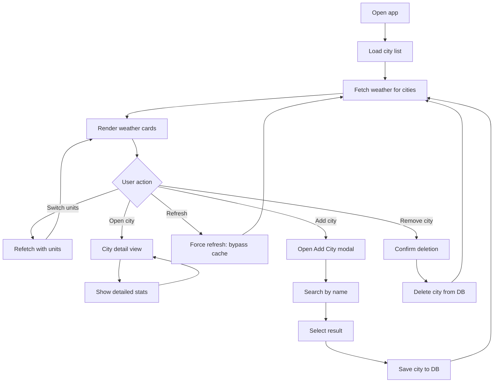
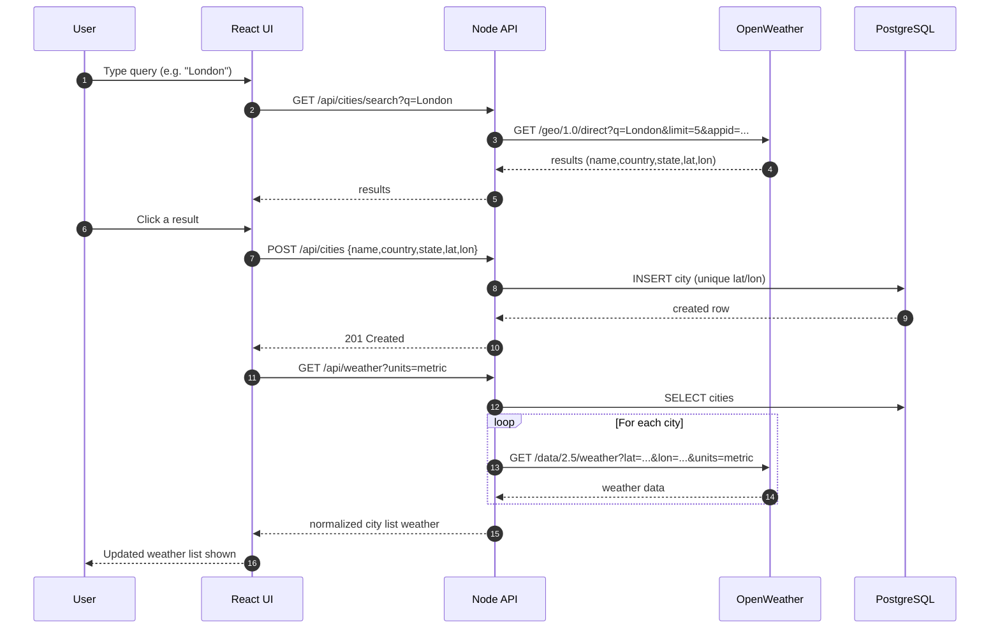

# Weather Dashboard

A weather dashboard application that displays current weather for cities worldwide. Users can add and remove cities via search (OpenWeather Geocoding API). Weather data is stored in PostgreSQL and fetched by coordinates.

## Features

* **City List View**: Display weather cards for cities from the database
* **Add City**: Search by name and add cities to your list
* **Remove City**: Delete cities from your list (with confirmation)
* **City Detail View**: Detailed weather statistics (temp, humidity, wind, pressure, visibility, sunrise/sunset)
* **Unit Switcher**: Metric (°C), Imperial (°F), Standard (K)
* **Caching**: 5-minute in-memory cache with force refresh
* **Responsive Design**: Tailwind CSS

## Quickstart (Docker)

```bash
# 1. Copy env file and set your OpenWeather API key
cp .env.example .env
# Edit .env and set OPENWEATHER_API_KEY=your_actual_key

# 2. Start all services
docker compose up --build
```

Open **[http://localhost:5173](http://localhost:5173)**. The database is initialized automatically with 10 cities.

## Diagrams

### User Workflow



### Add City Sequence (Search → Select → Persist)



## Environment Variables

| Variable              | Required | Description                              |
| --------------------- | -------- | ---------------------------------------- |
| `OPENWEATHER_API_KEY` | Yes      | Get a free key at openweathermap.org/api |

`DATABASE_URL` is set automatically by Docker Compose — do not override.

## Reset DB

```bash
docker compose down -v
docker compose up --build
```

## Troubleshooting

| Problem                              | Solution                                                  |
| ------------------------------------ | --------------------------------------------------------- |
| Failed to connect to weather service | Ensure OPENWEATHER_API_KEY is set in .env                 |
| Database connection failed           | Run docker compose down -v then docker compose up --build |
| Ports in use                         | Stop other processes or change docker-compose.yml         |
| Backend exits on startup             | Run docker compose logs backend                           |

## Optional: Local Development

1. Start PostgreSQL and create database weather
2. Run backend/scripts/init.sql and seed.sql
3. Set DATABASE_URL in backend/.env
4. Run backend and frontend

## API Endpoints

* GET /api/weather
* GET /api/weather/:id
* GET /api/cities
* GET /api/cities/search
* POST /api/cities
* DELETE /api/cities/:id

## License

MIT
